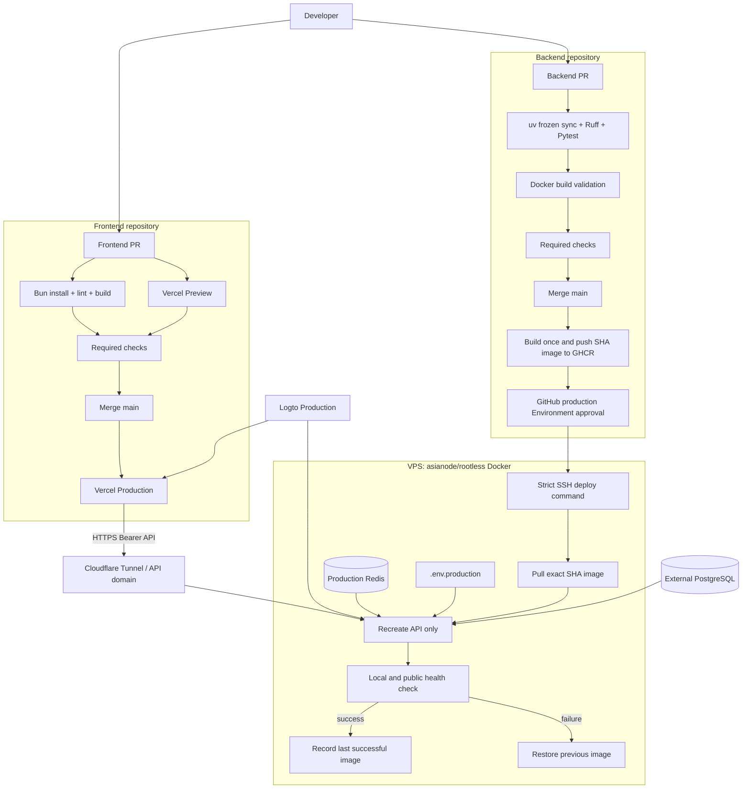
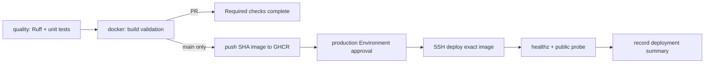

# Asianode Agent CI/CD 自动化实施架构计划

## 1. 文档信息

| 项目 | 内容 |
| --- | --- |
| 文档状态 | Draft，待按阶段实施 |
| 适用系统 | `asianodeagent-front` React/Vite 前端 + `asianode-fastapi` FastAPI 后端 |
| 前端托管 | Vercel GitHub Integration |
| 后端镜像 | GitHub Actions 构建并推送到 GHCR |
| 后端运行 | VPS 上 `asianode` Linux 用户的 rootless Docker Compose |
| 生产触发 | 后端 `main` 分支 push，通过 `production` Environment 审批后继续 |
| 发布单元 | 以 Git commit SHA 标记的不可变 Docker 镜像 |
| 本文边界 | 定义架构、实施顺序、配置清单、验收与回滚；不在本文阶段改动 VPS |

## 2. 当前仓库事实

本方案按当前实际代码和目录结构设计，不假设前后端在同一仓库。

| 项目 | 当前值 | CI/CD 影响 |
| --- | --- | --- |
| 前端本地目录 | `../asianodeagent-front` | 拥有独立 GitHub workflow |
| 前端 GitHub 仓库 | `BelongToMachine/agent-workflow-react-front` | Vercel 只连接此仓库 |
| 前端技术栈 | React 19 + Vite 8 + Bun 1.3.11 | CI 执行 `bun install --frozen-lockfile`、`bun run lint`、`bun run build` |
| 前端发布配置 | `vercel.json` 已存在，当前未跟踪 | 必须先提交，保证 SPA 深层路由回退到 `index.html` |
| 后端本地目录 | 当前仓库 `asianode-fastapi` | 拥有独立 GitHub workflow |
| 后端 GitHub 仓库 | `BelongToMachine/agent-workflow-fast-api` | 若使用 `${{ github.repository }}` 则默认镜像名与目标名不同 |
| 后端技术栈 | Python 3.12 + `uv` + FastAPI | CI 执行 frozen sync、Ruff 和 Pytest |
| 单元测试 | `uv run pytest -m "not integration"` | 不依赖生产数据库或 Redis |
| 集成测试 | `tests/test_infrastructure_integration.py` | 需显式提供本地/隔离的 PostgreSQL、Redis、S3 或 provider，不应指向生产 |
| 镜像入口 | `uvicorn app.main:app --host 0.0.0.0 --port 8000 --workers 1` | 与现有 2 GB VPS 规划一致 |
| 健康检查 | `GET /api/v1/healthz` | 当前是 liveness，只能确认 API 进程可响应 |
| Preview Compose | `compose.preview.yaml`，本地 `build:`，回环端口 `18000` | 保留不动，不作为生产自动发布文件 |
| 数据库 | 外部 PostgreSQL | CI/CD 不在 VPS 创建 PostgreSQL |
| Redis | Preview Compose 中有独立 Redis | 生产需使用独立 Compose project/network，不重启 Preview Redis |

### 2.1 实施前必须确认的命名

期望的镜像名是：

```text
ghcr.io/belongtomachine/asianode-fastapi:sha-<40-character-commit-sha>
```

但后端 GitHub 仓库当前名称是 `agent-workflow-fast-api`。因此 workflow 不能直接把
`${{ github.repository }}` 当作目标镜像名，而应显式定义：

```yaml
env:
  REGISTRY: ghcr.io
  IMAGE_NAME: belongtomachine/asianode-fastapi
```

首次推送后检查 GHCR package 是否已关联到后端仓库，并在镜像中添加
`org.opencontainers.image.source` label。如果不希望维护自定义包名，则改用
`ghcr.io/belongtomachine/agent-workflow-fast-api`；两者只能选一个作为长期主名。

## 3. 目标架构



### 3.1 发布责任边界

| 系统 | 负责 | 不负责 |
| --- | --- | --- |
| Vercel | 前端 Preview/Production 构建、静态资源发布、前端回滚 | FastAPI 镜像、VPS 进程、后端密钥 |
| Frontend Actions | Bun 依赖锁定、lint、build，作为 PR 必需检查 | 不用 Vercel CLI 重复发布 |
| Backend Actions | Ruff/Pytest、Docker 构建、GHCR 推送、触发受控部署 | 不保存应用运行密钥，不操作 rootful Docker |
| GHCR | 保存 commit SHA 镜像和可选 attestation/SBOM | 不向容器注入 `.env.production` |
| VPS | 保存生产环境变量、拉取镜像、运行 API/Redis、健康检查和回滚 | 不在发布时从源码本地 build |
| Cloudflare Tunnel | 把公网 API 域名转发到 VPS 回环端口 | 常规发布时不修改 Tunnel/WireGuard |

## 4. 分支、环境与触发矩阵

| 事件 | 前端仓库 | 后端仓库 | 是否发布生产 |
| --- | --- | --- | --- |
| PR 新建/更新 | Bun lint + build；Vercel 自动 Preview | Ruff + 非 integration Pytest + Docker build validation | 否 |
| PR 合并前 | GitHub branch protection 要求前端 CI 和 Vercel check 通过 | branch protection 要求后端 CI 通过 | 否 |
| push `main` | Vercel Git Integration 发布 Production；Actions 再次校验 | 校验、构建一次、推送 SHA 镜像、等待 production 审批 | 前端自动；后端审批后自动 |
| `workflow_dispatch` | 原则上不需要 | 重新部署已存在的 SHA/digest，用于回滚 | 是，需审批 |
| tag/release | 初期不作为生产触发 | 可后续添加发行记录，不取代 SHA 镜像 | 否，除非后续明确改流程 |

Vercel Git Integration 与前端 Actions 实际上会并行执行，不是物理上的“CI 成功后才开始
Preview”。通过 branch protection 同时要求两个 check，可以保证未通过校验的 PR 不能进入
`main`。如必须严格串行，需另外评估 Vercel Deployment Checks，不建议为此改回 Actions
手工发布前端。

## 5. 前端 CI 与 Vercel 设计

### 5.1 需新增/确认的文件

| 文件 | 操作 | 目的 |
| --- | --- | --- |
| `asianodeagent-front/vercel.json` | 提交现有文件 | React Router SPA 路由刷新时回退到 `/index.html` |
| `asianodeagent-front/.github/workflows/ci.yml` | 新增 | 在 PR 和 `main` 执行 frozen install、lint、build |
| `asianodeagent-front/.gitignore` | 复核/加固 | 不允许本地 `.env.*` 真实值入库；保留 `.env.example` |

### 5.2 前端 workflow 逻辑

```yaml
name: Frontend CI

on:
  pull_request:
    branches: [main]
  push:
    branches: [main]

permissions:
  contents: read

concurrency:
  group: frontend-ci-${{ github.workflow }}-${{ github.ref }}
  cancel-in-progress: true

jobs:
  quality:
    runs-on: ubuntu-latest
    steps:
      - uses: actions/checkout@<pinned-full-commit-sha>
      - uses: oven-sh/setup-bun@<pinned-full-commit-sha>
        with:
          bun-version: "1.3.11"
      - run: bun install --frozen-lockfile
      - run: bun run lint
      - run: bun run build
```

实施时所有第三方 Action 应锁定到完整 commit SHA，并用注释记录对应版本；不直接使用
`@main`。Bun 版本与 `package.json` 的 `packageManager` 保持一致。

### 5.3 Vercel Git Integration

Vercel Project 连接 `BelongToMachine/agent-workflow-react-front`：

| 设置 | 值 |
| --- | --- |
| Framework Preset | Vite |
| Install Command | `bun install --frozen-lockfile` |
| Build Command | `bun run build` |
| Output Directory | `dist` |
| Production Branch | `main` |
| PR/feature branches | Preview Deployment |
| `main` | Production Deployment |

前端 Production 和 Preview 必须使用不同的 Logto SPA App ID。`VITE_*` 值会被编译进浏览器
JavaScript，不得在其中放 client secret、API key 或其他服务端密钥。

| 变量 | Preview | Production |
| --- | --- | --- |
| `VITE_LOGTO_ENDPOINT` | Dev/Preview Logto tenant endpoint | Production Logto tenant endpoint |
| `VITE_LOGTO_APP_ID` | Dev SPA App ID | Production SPA App ID |
| `VITE_LOGTO_API_RESOURCE` | Preview API resource | Production API resource |
| `VITE_FASTAPI_URL` | Preview/staging API HTTPS URL | Production API HTTPS URL |
| `NEXT_PUBLIC_FASTAPI_BASE_URL` | Preview/staging API HTTPS URL | Production API HTTPS URL |
| `NEXT_PUBLIC_API_MODE` | `fastapi-direct` | `fastapi-direct` |
| `VITE_WORKSPACE_ID` | Preview workspace UUID | Production workspace UUID |
| `VITE_SINGLE_WORKSPACE_MODE` | `true` | `true` |

当前 production build 在 Logto 已配置时会强制使用 FastAPI direct mode，但仍建议显式写入
`NEXT_PUBLIC_API_MODE=fastapi-direct`，使环境意图清晰。Vercel 的 `vercel.json` 只处理 SPA 回退，
不是 FastAPI 反向代理。

### 5.4 PR Preview、CORS 与 Logto 回调

Vercel 每个 PR 的动态域名不能只靠“使用 Dev App ID”就自动获得完整登录能力：

1. FastAPI 当前 `CORS_ORIGINS` 使用精确 origin 列表，不支持动态 PR 域名正则。
2. Logto SPA 也需要允许精确的 callback URI 和 post-logout URI。
3. 不应为了方便而放开 `CORS_ORIGINS=*` 或过度宽泛的回调域名。

推荐分工：

- 每个 PR 仍自动获得 Vercel Preview，用于页面、布局和构建结果检查。
- 保留一个固定 `staging` 分支及稳定 Preview 域名，用于 Logto + FastAPI 完整联调。
- Dev Logto App 只注册这个稳定 Preview 域名的 `/callback` 与登出返回地址。
- Preview FastAPI 的 `CORS_ORIGINS` 只加入稳定 Preview 域名。
- 若未来确实需要所有 PR 域名完整登录，再单独实施受限制的 Vercel project origin 正则和
  Logto 回调注册自动化，并先做安全审查。

## 6. 后端镜像与 Production Compose 设计

### 6.1 目标文件

| 文件 | 是否入 Git | 用途 |
| --- | --- | --- |
| `.github/workflows/pipeline.yml` | 是 | PR CI；`main` 构建/推送/部署 |
| `compose.production.yaml` | 是 | 生产 API/Redis 定义，API 只使用 `image:` |
| `.env.production.example` | 是 | 生产变量名称和说明，只有占位符 |
| `scripts/deploy-production.sh` | 是 | VPS 上的受控部署、健康检查、失败回滚 |
| `.env.production` | 否，仅 VPS | FastAPI 运行密钥与环境变量，权限 `0600` |
| `.deploy.env` | 否，仅 VPS | 当前 `IMAGE_REF`，不包业务密钥 |
| `last-successful-image` | 否，仅 VPS | 最后一个健康镜像引用，用于自动/手工回滚 |

后端当前 `.gitignore` 只忽略 `.env` 和 `.env.local`，并不会忽略 `.env.production`。
在生成生产文件前必须先改成类似：

```gitignore
.env
.env.*
!.env.example
!.env.*.example
```

并用 `git check-ignore .env.production` 验证，再创建真实文件。

### 6.2 Production Compose 约束

`compose.production.yaml` 建议使用完整镜像引用，而不只使用可为空的 `IMAGE_TAG`：

```yaml
name: asianode-production

services:
  api:
    image: ${IMAGE_REF:?IMAGE_REF is required}
    env_file:
      - /home/asianode/asianode-production/.env.production
    ports:
      - "127.0.0.1:28000:8000"
    depends_on:
      redis:
        condition: service_healthy
    restart: unless-stopped
    init: true
    cpus: 1.0
    mem_limit: 768m
    pids_limit: 256
    cap_drop: [ALL]
    security_opt:
      - no-new-privileges:true
    read_only: true
    tmpfs:
      - /tmp:size=64m,mode=1777
    healthcheck:
      test:
        - CMD
        - python
        - -c
        - >-
          import urllib.request;
          urllib.request.urlopen('http://127.0.0.1:8000/api/v1/healthz', timeout=3)
      interval: 10s
      timeout: 5s
      retries: 6
      start_period: 20s
    networks:
      - asianode_production_internal

  redis:
    image: redis:7-alpine
    user: redis
    command: [redis-server, --appendonly, "no", --maxmemory, 128mb, --maxmemory-policy, allkeys-lru]
    restart: unless-stopped
    healthcheck:
      test: [CMD, redis-cli, ping]
      interval: 10s
      timeout: 3s
      retries: 5
    networks:
      - asianode_production_internal

networks:
  asianode_production_internal:
    name: asianode-production-internal
```

上述是目标结构，实施时要复用 Preview Compose 中已有的 logging/resource/security 限制。
生产日常发布只执行：

```bash
docker compose \
  --project-name asianode-production \
  --env-file /home/asianode/asianode-production/.deploy.env \
  -f /home/asianode/asianode-production/compose.production.yaml \
  up -d --no-deps api
```

该命令不重启 Redis，不操作 Preview Compose project，不修改 Cloudflare Tunnel 或 WireGuard。
生产 Redis 仅在首次初始化或明确的 Redis 维护窗口单独操作。

端口 `28000` 用于允许生产与当前 `18000` Preview 并行验证。首次上线通过后，只做一次
Cloudflare Tunnel upstream 切换：

```text
Production API domain -> http://127.0.0.1:28000
```

后续发布不再修改 Tunnel。如果实际生产端口已确定为其他值，则在实施前替换
`28000`，但不能与 Preview 同时占用 `18000`。

### 6.3 本地文件存储注意事项

现有 Preview 配置是 `read_only: true`，且没有挂载 knowledge/attachment 持久化目录。因此生产必须
二选一：

- 继续关闭本地文件上传，或使用 S3-compatible provider；
- 为 `storage/knowledge` 和 `storage/attachments` 设置明确的 VPS bind mount/volume，并校验
  容器 UID `10001` 权限、备份和磁盘容量。

不能在可写数据仍位于容器层时开启生产上传功能，否则重建 API 容器会丢失文件。

### 6.4 镜像标签与可回滚性

| 标签/引用 | 是否部署 | 用途 |
| --- | --- | --- |
| `sha-<full-git-sha>` | 是 | 人类可读、与 commit 一一对应 |
| image digest `sha256:...` | 可在后续加强为最终部署引用 | 防止 tag 被重写，可达到真正不可变 |
| `latest` | 可选发布，禁止部署 | 只作为人工浏览别名，不可用于生产和回滚 |

初期可使用完整 SHA tag；当 pipeline 稳定后，让 build job 输出 GHCR digest，deploy job 使用
`ghcr.io/...@sha256:...`，同时保留 SHA tag 用于排查。

## 7. 后端 GitHub Actions 设计

### 7.1 Workflow job DAG



建议用一个 `pipeline.yml` 让同一个 `main` commit 从测试进入 build/push/deploy，避免使用
`workflow_run` 在不同 workflow 间传递高权限和 artifact。

### 7.2 权限最小化

```yaml
permissions:
  contents: read
```

只有 GHCR 推送 job 增加：

```yaml
permissions:
  contents: read
  packages: write
  attestations: write  # 只在实施 provenance 时需要
  id-token: write      # 只在实施 provenance/OIDC 时需要
```

PR job 不读取 `production` Environment secrets，不登录 GHCR，不连接 VPS。

### 7.3 Quality job

```yaml
steps:
  - uses: actions/checkout@<pinned-full-commit-sha>
  - uses: astral-sh/setup-uv@<pinned-full-commit-sha>
    with:
      version: "0.11.3"
      python-version: "3.12"
      enable-cache: true
  - run: uv sync --frozen
  - run: uv run ruff check .
  - run: uv run pytest -m "not integration"
```

当前 `pyproject.toml` 未锁定 uv 工具版本，但 Dockerfile 允许 `uv>=0.6,<1.0`。本文生成时本地已用
uv `0.11.3` 通过 Ruff 和非 integration 测试，因此它可作为首版 CI 基线。实施时还应把
Dockerfile 中的 uv 安装改为同一精确版本，而不是在 CI 或 image build 时每次解析一个新版本。

### 7.4 Docker build/push job

PR 上只做 Docker build validation，不 push。`main` 上复用同一个 Dockerfile 进行实际 push：

1. 使用 Buildx 和 GitHub Actions layer cache。
2. 用 `GITHUB_TOKEN` 登录 `ghcr.io`，username 使用 `${{ github.actor }}`。
3. 推送 `sha-${{ github.sha }}`，禁止用短 SHA 作为唯一标签。
4. 记录 OCI source/revision/created labels。
5. 建议输出 SBOM 和 GitHub artifact attestation。
6. 初期只构建 `linux/amd64`，但必须先用 `uname -m` 确认 VPS 架构；如果是 ARM，则改为
   `linux/arm64` 或明确的 multi-arch build。
7. 锁定 Python 基础镜像 digest 和 uv 精确版本，由受审核的 Dependabot/维护 PR 升级。

“build once, deploy the same artifact”是必须约束：deploy job 不再 build，回滚 job 也不再 build。

### 7.5 Deploy job

```yaml
deploy-production:
  if: github.event_name == 'push' && github.ref == 'refs/heads/main'
  needs: [quality, publish-image]
  runs-on: ubuntu-latest
  environment:
    name: production
    url: https://<production-api-domain>/api/v1/healthz
  concurrency:
    group: asianode-fastapi-production
    cancel-in-progress: false
```

`cancel-in-progress: false` 防止一个已开始的生产替换被中途取消。部署 job 只把镜像引用
传给 VPS 上的固定脚本，不把 `.env.production` 从 GitHub 复制到服务器。

SSH 步骤必须：

- 把 `VPS_SSH_KEY` 写入 runner 临时文件，权限 `0600`，job 结束后由 ephemeral runner 销毁。
- 使用事先人工核验指纹后保存的 `VPS_KNOWN_HOSTS`。
- 强制 `StrictHostKeyChecking=yes`，不在 workflow 内临时 `ssh-keyscan` 并盲信结果。
- 以 `VPS_USER=asianode` 登录，不执行 `sudo`，不设置 rootful Docker socket。
- 调用 VPS 上的固定绝对路径脚本，远程参数只允许符合白名单正则的 GHCR image ref。

## 8. GitHub 仓库与 Secrets 配置

### 8.1 `production` Environment

在后端 GitHub 仓库创建 `production` Environment：

| 配置 | 要求 |
| --- | --- |
| Deployment branches | 只允许 protected `main` |
| Required reviewers | 至少 1 人；如可用，禁止 self-review |
| Environment secrets | 仅下表的 VPS SSH 秘密 |
| Concurrency | 同一时间只有一个 production deploy |

GitHub Environment 的 required reviewers 是否支持私有仓库，与当前 GitHub plan 有关。实施时要在
当前组织实际验证；如 plan 不提供此能力，则使用受保护的 `workflow_dispatch` 作为过渡人工门，
不要假设审批规则已生效。

### 8.2 GitHub Secrets

| Secret | 位置 | 内容 | 注意 |
| --- | --- | --- | --- |
| `VPS_HOST` | `production` Environment | VPS 主机名或 IP | 不硬编码在 workflow |
| `VPS_USER` | `production` Environment | `asianode` | 可改为 environment variable，但禁止变成 root |
| `VPS_SSH_KEY` | `production` Environment | CI 专用 SSH 私钥 | 不得复用本地个人管理密钥 |
| `VPS_KNOWN_HOSTS` | `production` Environment | 已核验指纹的 known_hosts 行 | 不在 job 中动态信任未核验 key |

`GITHUB_TOKEN` 由 GitHub Actions 自动提供，只用于 Actions runner 推送 GHCR，不是 VPS 上
`docker pull` 的长期凭据。

### 8.3 GHCR 私有镜像拉取

如果 GHCR package 是 public，VPS 可以匿名 pull。如果是 private，则在 VPS 上为 `asianode` 用户一次性
执行安全登录：

1. 创建仅有 `read:packages` 的机器凭据（按组织政策选择 PAT/GitHub App）。
2. 由运维人员通过 stdin 输入 `docker login ghcr.io`，不在 shell history 或 Actions log 中传递 token。
3. 凭据保存在 `asianode` 的 rootless Docker config，定期轮换。
4. 在发布流程启用前，以 `asianode` 身份验证可 pull 目标 SHA 镜像。

因此，原始的四个 GitHub Secrets 对 SSH 足够，但它们本身不解决 private GHCR 的 VPS pull 授权。

### 8.4 `main` 分支保护

前后端两个仓库都应：

- 要求 PR 后才能合并。
- 要求相应 CI checks 通过；前端还要求 Vercel check。
- 要求 branch 在合并前与 `main` 保持最新。
- 限制直接 push 和 force push。
- 保留管理员应急通道，但每次 bypass 都必须可审计。

前端 Vercel Production 会在 `main` push 后立即开始，所以“禁止未经 PR 的 main 直推”是前端生产门禁的
核心，不能仅依赖合并后的 Actions CI。

## 9. VPS Rootless Docker 一次性准备

### 9.1 预检

以现有服务器变更规则先确认目标主机、OS、CPU 架构、空闲内存、磁盘和端口：

```bash
uname -a
uname -m
free -h
df -h
ss -lntup
```

记录 WireGuard、Cloudflare Tunnel 和现有 Preview API 的基线，再复核 rootless Docker：

```bash
systemctl --user is-active docker
docker info
docker compose version
```

`docker info` 必须显示 rootless 安全选项。必要时由管理员一次性开启
`loginctl enable-linger asianode`，使用户级 Docker 在 VPS 重启后能自动运行。不要在预检失败时自动
切换到 rootful Docker。

### 9.2 生产目录

```text
/home/asianode/asianode-production/
├── compose.production.yaml
├── .env.production             # 0600, asianode:asianode
├── .deploy.env                 # 当前 IMAGE_REF
├── last-successful-image
├── bin/
│   └── deploy-production           # 可执行，只接受镜像引用
└── locks/
    └── deploy.lock
```

Compose 和 deploy script 可以在初次 bootstrap 时由人工核对后安装。后续当它们变更时，应作为
单独的受审批运维变更，不要在每次应用发布前无条件覆盖服务器上的部署逻辑。

### 9.3 `.env.production` 范围

真实值只由 VPS 持有，至少覆盖：

```dotenv
APP_NAME=Asianode FastAPI
ENVIRONMENT=production
DEBUG=false

DEEPSEEK_API_KEY=<vps-only>
DEEPSEEK_BASE_URL=https://api.deepseek.com/v1
CHAT_MODEL=deepseek-chat
CHAT_PROVIDER_TIMEOUT_SECONDS=60

POSTGRES_URL=<vps-only-production-database-url>
REDIS_URL=redis://redis:6379/0

CORS_ORIGINS=https://<production-frontend-domain>
DEFAULT_WORKSPACE_ID=<production-workspace-uuid>
SINGLE_WORKSPACE_MODE=true

AUTH_REQUIRED=true
AUTH_ISSUER=https://<production-logto-endpoint>/oidc
AUTH_AUDIENCE=<production-api-resource>
AUTH_JWKS_URL=https://<production-logto-endpoint>/oidc/jwks
AUTH_ALGORITHMS=RS256
AUTH_SECRET=<at-least-32-random-characters>

RATE_LIMIT_ENABLED=true
RATE_LIMIT_REDIS_ENABLED=true
SQLADMIN_ENABLED=false
```

再根据当前业务开关加入 knowledge base、embedding、S3 和 attachment 变量。不得加入
`DEV_OIDC_*`，不得从 `.env.preview` 复制 staging 数据库、CORS 或 Logto audience。

### 9.4 SSH 部署账号加固

为 Actions 创建独立 SSH key，公钥加入 `asianode` 的 `authorized_keys`。在初期部署稳定后，建议进一步使用
forced command，并关闭 agent/X11/port forwarding 和 PTY，使 CI key 只能调用 deployment entrypoint。

## 10. VPS 部署脚本逻辑

`deploy-production` 必须是幂等、可并发锁定且失败可回滚的。逻辑顺序：

1. 开启 `set -Eeuo pipefail`，通过 `flock` 获取生产部署锁。
2. 验证只有 `asianode` 用户能运行，验证 Docker context/rootless socket。
3. 白名单验证 `IMAGE_REF` 必须来自指定 GHCR package，且 tag 为完整 Git SHA，或是合法 digest。
4. 检查磁盘空间、`.env.production` 存在且权限不宽于 `0600`。
5. 执行 `docker pull "$IMAGE_REF"`，拉取失败时不改动现有容器。
6. 从 `.deploy.env` 和 `docker inspect` 读取当前镜像，写入临时 previous 记录。
7. 原子替换 `.deploy.env` 中的 `IMAGE_REF`。
8. 执行 `docker compose ... up -d --no-deps api`，不操作 Redis。
9. 在限定时间内轮询 `http://127.0.0.1:28000/api/v1/healthz`，验证 HTTP 200 以及 JSON 中
   `status=ok`、`environment=production`。
10. 再从公网 API 域名检查同一路径，确认 Cloudflare Tunnel 路径可用。
11. 成功时写入 `last-successful-image`，输出容器名、image ref、时间和健康结果，不输出环境变量。
12. 失败时立即恢复 previous image ref，再执行一次 `up -d --no-deps api` 和健康检查；最后以
    非零状态退出，使 GitHub Deployment 显示失败。

不得在该脚本中执行：

```text
docker compose down
docker system prune
docker volume prune
sudo docker ...
```

镜像清理应是独立低频维护任务，并且只删除明确超过保留数量、不被任何容器使用的
Asianode 镜像。

## 11. 健康检查、可观测性与回滚

### 11.1 上线阶段检查

| 层级 | 检查 | 失败处理 |
| --- | --- | --- |
| 容器内 | Docker healthcheck 访问 `127.0.0.1:8000/api/v1/healthz` | 标记 unhealthy，不判定发布成功 |
| VPS 宿主机 | `127.0.0.1:28000/api/v1/healthz` | 自动恢复 previous image |
| 公网链路 | `https://<api-domain>/api/v1/healthz` | 如本地正常则标记 Tunnel/DNS 问题，并停止继续发布 |
| 业务 smoke | 不携密钥的公开合同，或使用专用低权限 smoke identity | 人工决定回滚，不在日志打印 token |

当前 `/healthz` 不连接 PostgreSQL/Redis，因此它只适合 liveness 和配置启动检查，不能证明
业务依赖完全可用。后续应新增 `/api/v1/readyz` 或独立 smoke test，以有上限的短超时验证：

- PostgreSQL 可连接和必需 migration 状态。
- Redis `PING`。
- 对象存储/provider 不建议每次 readiness 都调用，改用独立定时探测。

### 11.2 回滚

回滚输入必须是已存在且曾通过健康检查的 SHA tag/digest：

```text
workflow_dispatch(image_ref = previous SHA/digest)
  -> production approval
  -> VPS docker pull
  -> recreate api only
  -> health checks
```

回滚不会回滚数据库。因此代码和 schema 变更必须采用 expand/migrate/contract 兼容模式，确保上一个
应用镜像仍能使用当前 schema。

## 12. 数据库迁移策略

当前 migration runner 会拒绝在 staging/production 自动应用迁移，且当前 Dockerfile 只复制 `app/`，
没有把 `migrations/` 复制进镜像。因此第一版 CI/CD 明确不自动执行生产 migration。

需要 schema 变更时：

1. PR 中审查 SQL，确保向后兼容，并在隔离数据库运行 integration test。
2. 生产备份并验证可恢复。
3. 使用单独、手工触发、受 `production` Environment 保护的 migration workflow/运维流程。
4. 先应用 expand migration，再发布可同时兼容新旧 schema 的 API。
5. 完成数据回填与完整性检查，观察稳定后才单独执行 contract migration。

禁止把 destructive migration 放进 API 容器启动命令，也不允许每个 Uvicorn worker 在启动时自行迁移。

## 13. 实施计划表

| ID | 阶段 | 操作 | 交付物 | 验收标准 | 依赖/风险 |
| --- | --- | --- | --- | --- | --- |
| P0-01 | 决策 | 确认生产前端域名、API 域名、稳定 Preview 域名 | 域名清单 | Vercel、Logto、CORS、Tunnel 使用同一组值 | 不确认时不得上线 |
| P0-02 | 决策 | 确认 GHCR 长期镜像名 | 唯一 image namespace | workflow、Compose、VPS 白名单一致 | 当前 repo 名与目标镜像名不同 |
| P0-03 | 决策 | 确认 VPS CPU 架构和生产回环端口 | 预检记录 | build platform 与 VPS 一致，端口未占用 | 保护 Preview `18000` |
| P1-01 | 密钥安全 | 加固前后端 `.gitignore` | ignore rules | `git check-ignore` 确认 `.env.production` 被忽略 | 必须先于创建真实 env |
| P1-02 | 前端 | 提交已有 `vercel.json` | Git commit | 深层路由直接访问不 404 | 保持 direct API mode |
| P1-03 | 前端 | 新增 Frontend CI | `ci.yml` | PR 上 frozen install/lint/build 通过 | Bun 版本与 lockfile 一致 |
| P1-04 | 前端 | 配置 Vercel Git Integration 和分环境变量 | Vercel Project config | PR 有 Preview，`main` 发布 Production | Production 使用 Production Logto App ID |
| P1-05 | 前端 | 配置稳定 staging branch/domain | Preview E2E URL | Dev Logto 登录、callback、API CORS 通过 | 动态 PR URL 默认不承诺完整 auth |
| P2-01 | 后端 | 新增 `.env.production.example` | 无密钥模板 | 包含 production 必需项，不包真实值 | 与 `validate_runtime_settings` 一致 |
| P2-02 | 后端 | 新增 `compose.production.yaml` | image-only Compose | `docker compose config` 通过，无 `build:` | 要求 `IMAGE_REF` |
| P2-03 | 后端 | 为 Docker image 添加 OCI metadata，复核 `.dockerignore` | Dockerfile/.dockerignore | 镜像不包含 `.env*`、Git 元数据和测试缓存 | 当前仓库需确认/新增 `.dockerignore` |
| P2-04 | 后端 | 实现部署/回滚脚本 | `deploy-production.sh` | 参数白名单、flock、healthz、失败回滚都有测试 | 绝不运行 `compose down`/prune |
| P3-01 | VPS | 执行资源、网络、rootless Docker 预检 | 预检记录 | 不影响 WireGuard/Tunnel，容量达标 | 不自动切 rootful |
| P3-02 | VPS | 创建生产目录和 `.env.production` | VPS-only files | owner `asianode`，env 为 `0600` | 不从 preview 无审查复制 |
| P3-03 | VPS/GHCR | 配置 GHCR 只读 pull 凭据 | rootless Docker login | `asianode` 能 pull 指定 SHA 镜像 | private package 必须完成 |
| P3-04 | VPS/SSH | 安装 CI 专用 SSH key 和受限入口 | authorized key | CI 可调用 deploy，不可 root/port forward | 先保留人工应急通道 |
| P3-05 | VPS | 启动生产 Redis 和初始 API | production Compose project | `18000` Preview 和 `28000` Production 并行正常 | 首次人工操作 |
| P4-01 | GitHub | 创建 branch protection 和 production Environment | 仓库规则 | 未通过 CI 不能合并，deploy 等待审批 | 验证当前 GitHub plan |
| P4-02 | GitHub | 配置 4 个 VPS Environment secrets | encrypted secrets | PR job 无权读取，deploy job 审批后才可读 | known_hosts 指纹需带外核验 |
| P4-03 | 后端 | 实现 quality + Docker + GHCR + deploy workflow | `pipeline.yml` | PR 不 push；main 推送 SHA；审批后只更新 API | 所有 Actions 锁定 commit SHA |
| P4-04 | 后端 | 新增 manual redeploy/rollback 输入 | `workflow_dispatch` | 只接受合法 image ref，仍经 production 审批 | 禁止使用 `latest` |
| P5-01 | 验证 | 在非 main 分支验证 PR pipeline | CI 记录 | 失败 lint/test/build 能阻止合并 | 不允许访问 VPS secrets |
| P5-02 | 验证 | 推送第一个 main SHA 镜像但暂不切流 | GHCR image | VPS 可 pull，镜像架构正确 | 在 Environment 审批点停下复核 |
| P5-03 | 验证 | 部署到并行生产端口 | 首次 production container | 本地 healthz、Logto、CORS、DB/Redis smoke 都通过 | 不修改 Preview |
| P5-04 | 切流 | 一次性更新 Cloudflare Tunnel upstream | Production API domain | 公网 healthz 和前端 API 请求通过 | 保留原 upstream 供快速恢复 |
| P5-05 | 演练 | 故意部署一个健康失败的测试镜像/隔离环境失败注入 | 回滚记录 | 脚本自动恢复 previous image，GitHub 标红 | 不在业务高峰执行 |
| P5-06 | 演练 | VPS 重启演练 | 恢复记录 | rootless Docker、Redis、API、Tunnel、WireGuard 均恢复 | 需维护窗口 |
| P6-01 | 加强 | 新增 readiness 和业务 smoke | `/readyz`/独立 smoke | 可检测 DB/Redis 故障 | 探测要有短超时 |
| P6-02 | 加强 | 部署 digest、SBOM、attestation 与漏洞扫描 | 供应链记录 | 可验证源 commit，高危漏洞有处置策略 | 不让非确定扫描结果无限阻断应急修复 |
| P6-03 | 加强 | 评估 blue/green 或双容器滚动切换 | 低停机发布 | 新容器健康后才切 upstream | MVP 阶段 Compose recreate 有短暂中断 |

## 14. 分阶段上线准入

### Gate A：允许合并 CI 文件

- 前后端本地 lint/test/build 通过。
- 不包真实 secret。
- `.env.production` 已被 Git ignore，Docker build context 也排除 env 文件。
- PR workflow 无 `packages: write`、SSH 或 Environment secrets。

### Gate B：允许 GHCR 推送

- 镜像名已确认。
- Docker build 在目标架构通过。
- 镜像内没有 `.env*`、SSH key 或 GitHub token。
- GHCR package 与仓库关联正确。

### Gate C：允许首次 VPS 部署

- rootless Docker 和 linger 通过验证。
- `.env.production` 安全校验通过；FastAPI 不会因 unsafe production configuration 拒绝启动。
- `asianode` 能从 GHCR pull。
- 生产端口与 Preview 不冲突。
- 回滚镜像已确定，而不是空值。

### Gate D：允许切换生产流量

- VPS 本地 healthz 通过。
- PostgreSQL、Redis 和关键业务 smoke 通过。
- Production Logto 的 redirect URI、post-logout URI、API resource/audience 一致。
- Vercel Production 已使用 Production Logto App ID 和 Production API URL。
- Cloudflare Tunnel 原 upstream 已记录，可以快速恢复。

## 15. 上线后日常操作

### 正常发布

```text
PR -> CI -> review -> merge main
-> build/push sha image
-> approve production
-> deploy API only
-> health checks
```

### 应用回滚

```text
Select last known-good SHA/digest
-> workflow_dispatch
-> production approval
-> deploy API only
-> health checks
```

### 只修改环境变量

1. 人工备份 VPS `.env.production`。
2. 修改后用不显示值的方式复核变量名、文件 owner 和 mode。
3. 运行当前镜像的 redeploy，只 recreate API。
4. 执行 healthz 和业务 smoke。
5. 如失败，恢复 env 备份后再 recreate API；仅回滚镜像无法撤销错误 env。

### 生产配置/脚本变更

Compose、deploy script、rootless Docker 或 Tunnel 变更不属于普通应用发布，必须单独评审、备份，
并在维护窗口实施。

## 16. 验收清单

### Frontend

- [ ] `vercel.json` 已提交。
- [ ] PR 自动运行 Bun lint/build。
- [ ] PR 自动生成 Vercel Preview。
- [ ] `main` 自动发布 Vercel Production。
- [ ] Production 使用 Production Logto App ID，Preview/staging 使用 Dev App ID。
- [ ] Production 使用 Production FastAPI HTTPS URL，没有请求 Vercel 静态站点的 `/api`。
- [ ] Logto callback/登出回调与 Vercel 域名一致。

### Backend CI/GHCR

- [ ] PR 通过 Ruff、非 integration Pytest 和 Docker build。
- [ ] PR 不能 push package，不能读 production secrets。
- [ ] `main` 只推送完整 commit SHA 标签，发布不使用 `latest`。
- [ ] GHCR package 来源仓库、可见性和 VPS pull 权限正确。
- [ ] 第三方 Actions 锁定完整 commit SHA。

### VPS/Production

- [ ] 部署用户是 `asianode`，Docker 是 rootless。
- [ ] `.env.production` 仅在 VPS，mode 为 `0600`。
- [ ] Production Compose 只有 `image:`，没有 API `build:`。
- [ ] 普通发布执行 `up -d --no-deps api`，不重启 Redis。
- [ ] 容器内、VPS 本地、公网三层 healthz 通过。
- [ ] 失败发布能自动回到 previous image，手工 SHA 回滚也已演练。
- [ ] VPS 重启后 rootless Docker、API、Redis 自动恢复。
- [ ] Preview Compose、Cloudflare Tunnel 其他路由和 WireGuard 没有被常规发布修改。

## 17. 参考资料

- [GitHub Docs: Publishing Docker images](https://docs.github.com/en/actions/tutorials/publish-packages/publish-docker-images)
- [GitHub Docs: Working with the Container registry](https://docs.github.com/en/packages/working-with-a-github-packages-registry/working-with-the-container-registry)
- [GitHub Docs: Deployments and environments](https://docs.github.com/en/actions/reference/workflows-and-actions/deployments-and-environments)
- [GitHub Docs: Deploying with GitHub Actions](https://docs.github.com/en/actions/how-tos/deploy/configure-and-manage-deployments/control-deployments)
- [Vercel Docs: Deploying Git repositories](https://vercel.com/docs/git)
- [Vercel Docs: Environment variables](https://vercel.com/docs/environment-variables)
- [Vercel Docs: Environments](https://vercel.com/docs/deployments/environments)
- [uv: Using uv in GitHub Actions](https://github.com/astral-sh/uv/blob/main/docs/guides/integration/github.md)
- [setup-bun usage](https://github.com/oven-sh/setup-bun/blob/main/README.md)
